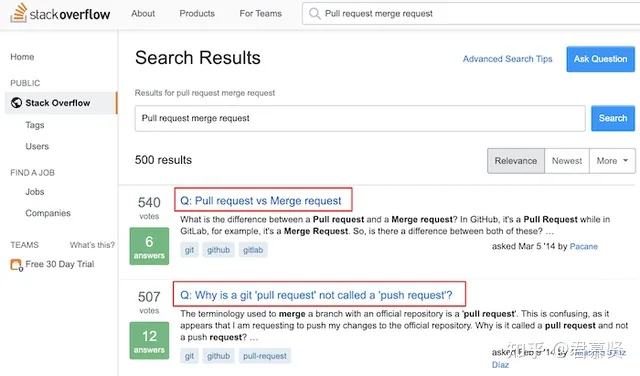
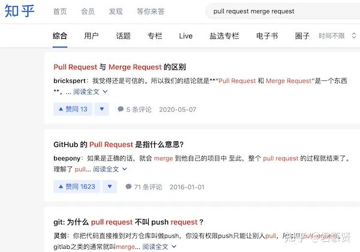

## 什么是Pull Request？

PR 的全称是Pull Request，经常用 Github 的同学对这个肯定很熟悉了。Github 聚集了4000万开发者，过亿的开源项目，如果想给别人的开源仓库贡献代码，通常是先 fork 别人的项目，然后本地修改完成提交到自己的个人 fork 仓库，最后提交 PR 等待别人合入你的代码。

Github 的工作流：

fork 工作流

我们重点看一下第6步，小明写完代码了想合入到原作者的仓库，新建了一个“pull request”，拉请求？这明明是推啊，小明将自己的修改推到原作者的仓，感觉叫“push request”比较合适吧。

既然 Github 坚持叫“pull request”，我们试着理解一下它的思路，小明写完代码了心里肯定是在想：原作者大神，我改了点东西，你快把我的修改拉回去吧。站在原作者的角度思考，叫pull request好像也说得过去，每天有大量的人从我这里 fork 代码走，我只会拉取我感兴趣的代码回来。

我好像把自己说服了。

## 什么是 Merge Request？

MR 的全称是 Merge Request，相信玩过 Gitlab 的同学都知道这个。

插播一下，Github这么好用了为什么还有人玩 Gitlab，这就要几年前说起了。在微软没有收购 Github 之前，Github 上面所有的项目必须是公开的，也就是说自己很渣的代码也必须要公开，不能藏着噎着。但是在一些小的公司或者创业团队，代码这种核心资产是不希望被公开，他们迫切需要私密仓这种需求，所以很多人都选择了 Gitlab。当然后面 Github 也放开了私有仓库，这是后话了。

merge 工作流

团队中每个人都从远程仓库 develop 分支拉取代码，本地基于 develop 分支新建特性分支，修改完代码将特性分支推到远程仓，紧接着新建 Merge Request 期望将自己的特性分支合入 develop 分支。

从上面这个流程来看Merge Request 就是将自己的特性分支合入到主干分支。

## Pull Request VS Merge Request

总结一下上面两个例子。

Github 是玩 fork 模式的，开发者提交自己的代码新建 Pull Request，请求原作者：“把我的代码拉回去吧”。

Gitlab 是玩分支模式的，开发者提交自己的代码新建 Merge Request，想将自己的特性分支合并到主干。

上面总结的好像很有道理，但是不要忘了，Github 也可以玩分支模式，Gitlab 也可以玩 fork 模式，更令人无语的是：

Github 上合并分支还是叫 Pull Request；Gitlab 上fork 模式也是叫 Merge Request；

不行，这种答案我没法接受，去 stackoverflow上搜一些大家是怎么理解的。果然有一个帖子很火：

Pull request vs Merge request

有一个回答摘取了 Gitlab 的官方解释：

> Merge or pull requests are created in a git management application and ask an assigned person to merge two branches. Tools such as GitHub and Bitbucket choose the name pull request since the first manual action would be to pull the feature branch. Tools such as GitLab and Gitorious choose the name merge request since that is the final action that is requested of the assignee. In this article we'll refer to them as merge requests.

翻译过来简单理解就是：这两个没有本质区别，站在不同立场说法不一样而已。

**好了，官方已经盖棺定论了，这两个就是一个东西，不要纠结啦~**

## 疯狂吐槽

对于初学者来说，Github 的 pull request 确实让人难以理解，我们去各大网站看看用户的声音。

StackOverflow

从国外到国内都有大量的用户对这个名字不理解，明明是提交提交代码，为什么是 pull request，有些人甚至怀疑是名字打错了。

如果让我来给 Github 取名字，我可能会取：

- push request 推请求
- merge request 合并请求

想多了，不会有如果。[嘿哈]

## 总结

Pull Request 和Merge Request 本质上都是合入代码，只是站在不同角度有不同的说法而已，因此在学习和工作中无论用哪一个都没有问题。